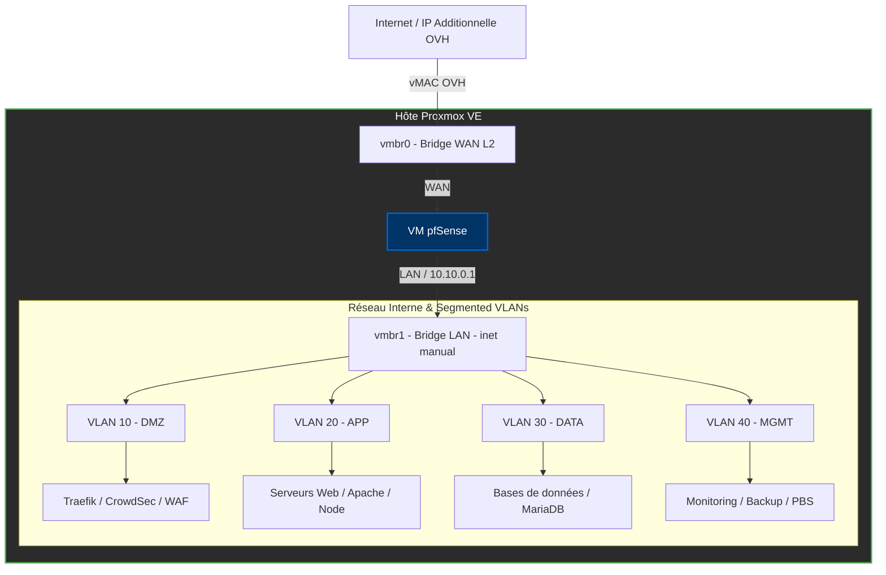

# 🛡️ Infrastructure Réseau & Sécurité Multi-VLAN sur Proxmox VE

> **Projet de déploiement d'une infrastructure d'entreprise sécurisée sur serveur dédié OVHcloud.**  
> Ce dépôt documente l'architecture réseau complète : segmentation par VLANs sous pfSense (Routed Bridge), filtrage applicatif (Traefik, WAF, CrowdSec), durcissement système et observabilité.

---

## Vue d'ensemble de l'architecture

---

## Infrastructure physique

| Composant | Spécification |
| :--- | :--- |
| **Fournisseur** | OVHcloud, serveur dédié |
| **CPU** | Intel Xeon E3-1230v6 — 4c/8t — 3.5/3.9 GHz |
| **RAM** | 32 Go ECC 2133 MHz |
| **Stockage** | 2×2 To HDD SATA, RAID logiciel |
| **Hyperviseur** | Proxmox VE 9 (template officiel OVHcloud) |

---

## Segmentation réseau

pfSense est le point d'entrée unique du réseau, configuré en architecture **Routed Bridge** (spécificité OVHcloud : l'IP Additional est associée à une vMAC attribuée à la carte réseau virtuelle de pfSense, qui assure le routage et le filtrage interne vers chaque VM).

Quatre VLANs séparent les rôles par fonction :

| VLAN | Rôle | Accès entrant autorisé |
| :--- | :--- | :--- |
| **DMZ (10)** | Reverse proxy, WAF | Internet via pfSense (ports 80/443 uniquement) |
| **APP (20)** | Serveur web (Apache, PHP) | VLAN DMZ uniquement |
| **DATA (30)** | Base de données (MariaDB) | VLAN APP uniquement (port 3306) |
| **MGMT (40)** | Sauvegarde, supervision, PVE | Accès distant via **VPN WireGuard (pfSense)** uniquement |

Le détail des règles de filtrage inter-VLAN est documenté dans [docs/02-reseau-vlan.md](docs/02-reseau-vlan.md).

---

## Détail des composants

* **Firewall / Routeur / DNS — pfSense :** 
  * Filtrage réseau L3/L4, NAT sortant, routage inter-VLAN strict.
  * Serveur **VPN WireGuard** pour l'accès d'administration sécurisé au VLAN MGMT et à l'IHM Proxmox (`:8006`).
  * Service **Unbound DNS (Split-Horizon)** pour la résolution directe des noms de domaine internes sans passer par le WAN (évite le Hairpin NAT). Configuration détaillée : [docs/03-pfsense.md](docs/03-pfsense.md).

* **Reverse Proxy & Edge Security (VLAN DMZ) :** 
  * **Traefik :** Gestion SSL/TLS automatique (Let's Encrypt), routage dynamique vers les conteneurs/VMs internes.
  * **WAF + CrowdSec :** Inspection applicative HTTP (L7) et blocage collaboratif des IP malveillantes.

* **Serveur Web (VLAN APP) :** 
  * Apache + PHP, VirtualHosts nommés, hébergeant l'ERP OpenConcerto — [docs/05-erp-openconcerto.md](docs/05-erp-openconcerto.md).

* **Base de données (VLAN DATA) :** 
  * MariaDB, accessible uniquement depuis le VLAN APP sur le port 3306.

---

## Sécurité — défense en profondeur

Plusieurs couches de sécurité indépendantes, chacune répondant à un besoin spécifique :

* **pfSense / VLANs :** Isolation réseau L2/L3 et filtrage inter-VLAN strict.
* **nftables (sur chaque VM) :** Pare-feu local filtrant strictly les flux entrants/sortants au niveau de l'hôte virtuel.
* **CrowdSec :** Détection d'intrusions et bannissement automatique comportemental.
* **WAF (sur Traefik) :** Filtrage applicatif contre les injections SQL, XSS et failles OWASP Top 10.
* **SSH durci :** Authentification par clé uniquement, port non standard, accès root désactivé.

Détail des règles de durcissement : [docs/04-hardening.md](docs/04-hardening.md).

---

## Sauvegarde et observabilité

* **Sauvegarde :** Règle 3-2-1-1-0 (3 copies, 2 supports, 1 hors site, 1 immuable, 0 erreur après test), via Proxmox Backup Server ou Borgbackup/Restic selon l'arbitrage documenté.
* **Supervision :** Prometheus + Grafana + Alertmanager pour les métriques et alertes, logs centralisés.

---

## Limites connues

Cette infrastructure applique les principes de production, mais reste un projet personnel — les limites suivantes sont assumées et documentées plutôt que masquées :

* **Single point of failure physique :** Un seul serveur, aucune haute disponibilité réelle (pas de second nœud Proxmox, pas de cluster, pas de stockage partagé type Ceph).
* **Pas de redondance géographique :** En dehors de la copie de sauvegarde hors site.

Ces écarts avec une architecture pleinement HA sont volontairement documentés : ils indiquent précisément ce qu'il faudrait ajouter à l'échelle d'une vraie production (second nœud physique, cluster, stockage partagé).

---

## Documentation complète

* [docs/01-architecture.md](docs/01-architecture.md)
* [docs/02-reseau-vlan.md](docs/02-reseau-vlan.md)
* [docs/03-pfsense.md](docs/03-pfsense.md)
* [docs/04-hardening.md](docs/04-hardening.md)
* [docs/05-erp-openconcerto.md](docs/05-erp-openconcerto.md)
* [docs/06-adr-migration-ovh.md](docs/06-adr-migration-ovh.md) — pourquoi ce projet succède à la version lab (8 Go RAM) et ce qui a changé.

---

## Stack technique

* **Hyperviseur :** Proxmox VE 9
* **Réseau & Sécurité :** pfSense (Routed Bridge, Unbound DNS, WireGuard)
* **Reverse Proxy & WAF :** Traefik, Coraza WAF, CrowdSec
* **Web & Data :** Apache, PHP, MariaDB, OpenConcerto
* **Système :** Debian, nftables, OpenSSH durci
* **Supervision & Sauvegarde :** Prometheus, Grafana, Proxmox Backup Server / Borgbackup

---

## Roadmap

* [ ] VPN site-à-site vers une seconde machine (Windows Server / Active Directory)
* [ ] Automatisation de la configuration (Ansible)
* [ ] Provisioning des ressources OVH via Terraform
* [ ] Tests de restauration de sauvegarde documentés

---

## Auteur & Contact

* **GitHub :** (https://github.com/chellala-cloud)
* **LinkedIn :** [Ton Prénom Nom](https://www.linkedin.com/in/ton-profil)
* **Projet :** Conçu et documenté dans le cadre de mon portfolio technique Systems & Networks.
